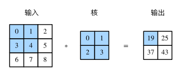

## 特征图与感受野
二维卷积层输出的二维数组可以看作是输入在空间维度（宽和高）上某一级的表征，也叫特征图（feature map）。影响元素x的前向计算的所有可能输入区域（可能大于输入的实际尺寸）叫做x的感受野（receptive field）。  
  
以图为例，输入中阴影部分的四个元素是输出中阴影部分元素的感受野。我们将图中形状为2×2的输出记为Y，将Y与另一个形状为2×2的核数组做互相关运算，输出单个元素z。那么，z在Y上的感受野包括Y的全部四个元素，在输入上的感受野包括其中全部9个元素。  
可见，我们可以通过更深的卷积神经网络使特征图中单个元素的感受野变得更加广阔，从而捕捉输入上更大尺寸的特征。
公式
((n-k+2p)/s   +   1)*((n-k+2p)/s   +   1)
## 卷积与全连接相比的优点
一是全连接层把图像展平成一个向量，在输入图像上相邻的元素可能因为展平操作不再相邻，网络难以捕捉局部信息。而卷积层的设计，天然地具有提取局部信息的能力。
二是卷积层的参数量更少。不考虑偏置的情况下，一个形状为(ci,co,h,w)的卷积核的参数量是ci×co×h×w，与输入图像的宽高无关。假如一个卷积层的输入和输出形状分别是(c1,h1,w1)和(c2,h2,w2)，如果要用全连接层进行连接，参数数量就是c1×c2×h1×w1×h2×w2。使用卷积层可以以较少的参数数量来处理更大的图像。
池化层主要用于缓解卷积层对位置的过度敏感性。