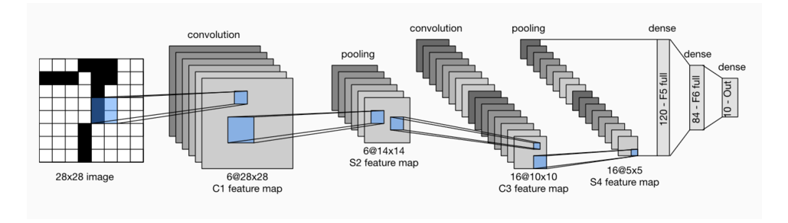
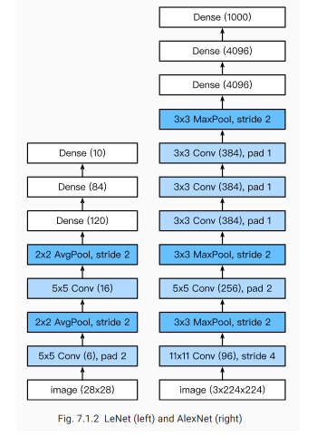
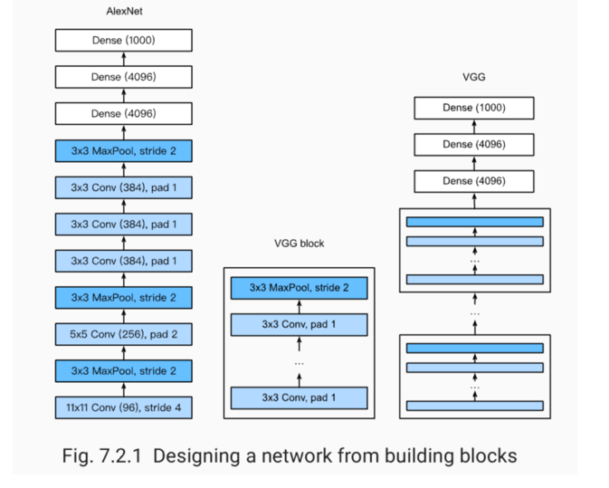
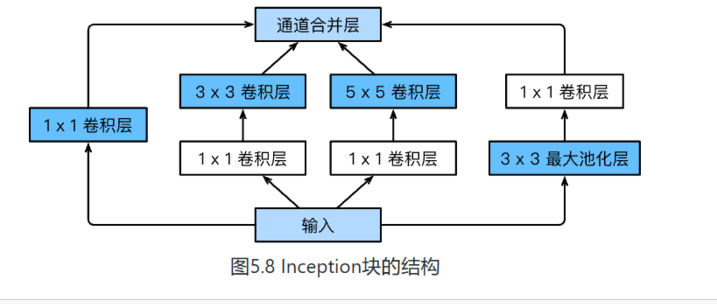

## LeNet
  
LeNet交替使用卷积层和最大池化层后接全连接层来进行图像分类。
## AlexNet
  
特征：

    8层变换，其中有5层卷积和2层全连接隐藏层，以及1个全连接输出层。
    将sigmoid激活函数改成了更加简单的ReLU激活函数。
    用Dropout来控制全连接层的模型复杂度。
    引入数据增强，如翻转、裁剪和颜色变化，从而进一步扩大数据集来缓解过拟合。
## VGG
VGG：通过重复使⽤简单的基础块来构建深度模型。   
Block:数个相同的填充为1、窗口形状为3×3的卷积层,接上一个步幅为2、窗口形状为2×2的最大池化层。卷积层保持输入的高和宽不变，而池化层则对其减半。
  

## 1×1卷积核
作用
1.放缩通道数：通过控制卷积核的数量达到通道数的放缩。
2.增加非线性。1×1卷积核的卷积过程相当于全连接层的计算过程，并且还加入了非线性激活函数，从而可以增加网络的非线性。
3.计算参数少

## GoogleNet
  
    由Inception基础块组成。
    Inception块相当于⼀个有4条线路的⼦⽹络。它通过不同窗口形状的卷积层和最⼤池化层来并⾏抽取信息，并使⽤1×1卷积层减少通道数从而降低模型复杂度。
    可以⾃定义的超参数是每个层的输出通道数，我们以此来控制模型复杂度。
