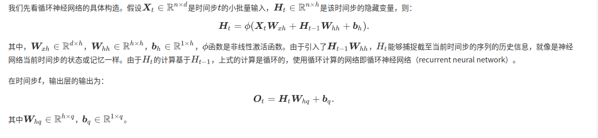
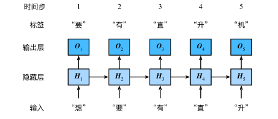
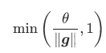

# 循环神经网络
我们的目的是基于当前的输入与过去的输入序列，预测序列的下一个字符。





# 裁剪梯度
循环神经网络中较容易出现梯度衰减或梯度爆炸，这会导致网络几乎无法训练。裁剪梯度（clip gradient）是一种应对梯度爆炸的方法。假设我们把所有模型参数的梯度拼接成一个向量g ，并设裁剪的阈值是θ。裁剪后的梯度



# one-hot
```python
def one_hot(x, n_class, dtype=torch.float32):
    result = torch.zeros(x.shape[0], n_class, dtype=dtype, device=x.device)  # shape: (n, n_class)
    result.scatter_(1, x.long().view(-1, 1), 1)  # result[i, x[i, 0]] = 1
    return result
```

# 困惑度

我们通常使用困惑度（perplexity）来评价语言模型的好坏。回忆一下“softmax回归”一节中交叉熵损失函数的定义。困惑度是对交叉熵损失函数做指数运算后得到的值。特别地，

    最佳情况下，模型总是把标签类别的概率预测为1，此时困惑度为1；
    最坏情况下，模型总是把标签类别的概率预测为0，此时困惑度为正无穷；
    基线情况下，模型总是预测所有类别的概率都相同，此时困惑度为类别个数。

显然，任何一个有效模型的困惑度必须小于类别个数。在本例中，困惑度必须小于词典大小vocab_size。
定义模型训练函数

跟之前章节的模型训练函数相比，这里的模型训练函数有以下几点不同：

    使用困惑度评价模型。
    在迭代模型参数前裁剪梯度。
    对时序数据采用不同采样方法将导致隐藏状态初始化的不同