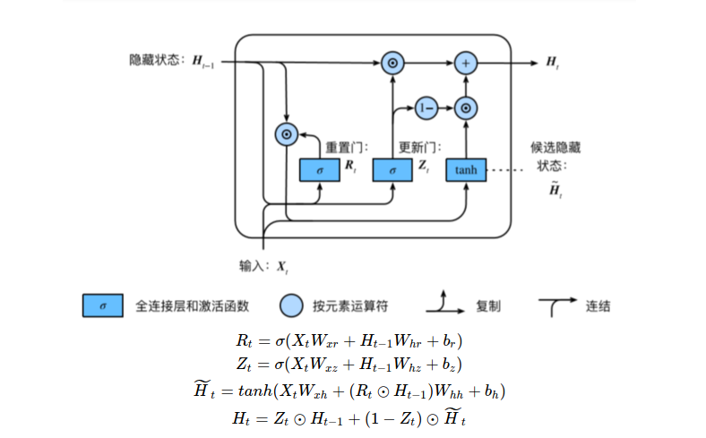
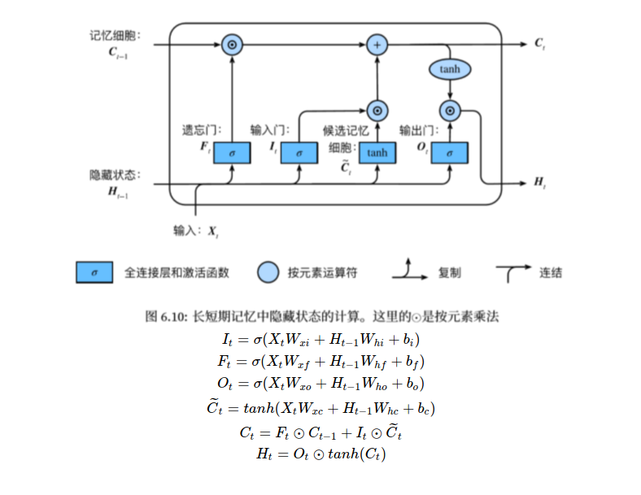
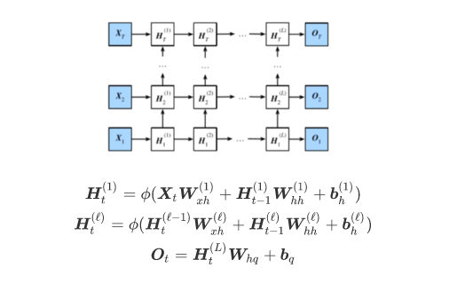
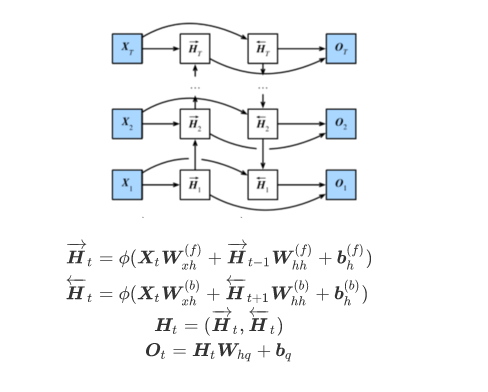

# GRU
RNN存在的问题：梯度较容易出现衰减或爆炸（BPTT）
⻔控循环神经⽹络：捕捉时间序列中时间步距离较⼤的依赖关系

https://zhuanlan.zhihu.com/p/32481747

重置⻔有助于捕捉时间序列⾥短期的依赖关系；

更新⻔有助于捕捉时间序列⾥⻓期的依赖关系。
# LSTM
长短期记忆long short-term memory :

遗忘门:控制上一时间步的记忆细胞  
输入门:控制当前时间步的输入     
输出门:控制从记忆细胞到隐藏状态     
记忆细胞：⼀种特殊的隐藏状态的信息的流动

# 深度循环神经网络

作用，可以提取到更深层次的特征

#双向循环神经网络
