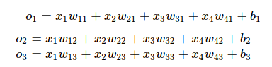
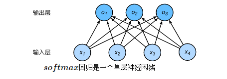
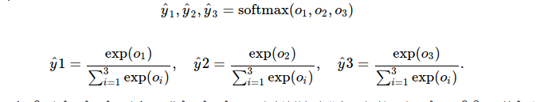
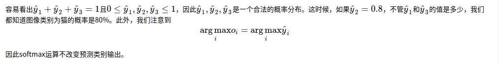
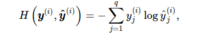
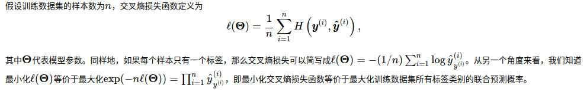
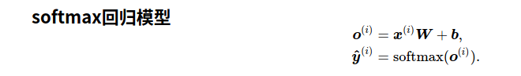

softmax回归同线性回归一样，也是一个单层神经网络。由于每个输出o1,o2,o3的计算都要依赖于所有的输入x1,x2,x3,x4，softmax回归的输出层也是一个全连接层。


将输出值变换成值为正且和为1的概率分布



# 交叉熵


平方损失则过于严格，交叉熵更适合衡量两个概率分布差异的测量函数


关键代码

```python


def softmax(X):
    X_exp = X.exp()
    partition = X_exp.sum(dim=1, keepdim=True)
    # print("X size is ", X_exp.size())
    # print("partition size is ", partition, partition.size())
    return X_exp / partition  # 这里应用了广播机制

```

```python


def net(X):
    return softmax(torch.mm(X.view((-1, num_inputs)), W) + b)


def cross_entropy(y_hat, y):
    return - torch.log(y_hat.gather(1, y.view(-1, 1)))


```