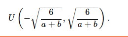

深度模型有关数值稳定性的典型问题是消失（vanishing）和爆炸（explosion）。
当神经网络的层数较多时，模型的数值稳定性容易变差,梯度的计算容易出现消失或爆炸
## 随机初始化模型参数
如果将每个隐藏单元的参数都初始化为相等的值，那么在正向传播时每个隐藏单元将根据相同的输入计算出相同的值，并传递至输出层。在反向传播中，每个隐藏单元的参数梯度值相等。
## Xavier随机初始化
目标就是使得每一层输出的方差应该尽量相等
 假设某全连接层的输入个数为a，输出个数为b，Xavier随机初始化将使该层中权重参数的每个元素都随机采样于均匀分布。
 
 

 它的设计主要考虑到，模型参数初始化后，每层输出的方差不该受该层输入个数影响，且每层梯度的方差也不该受该层输出个数影响。