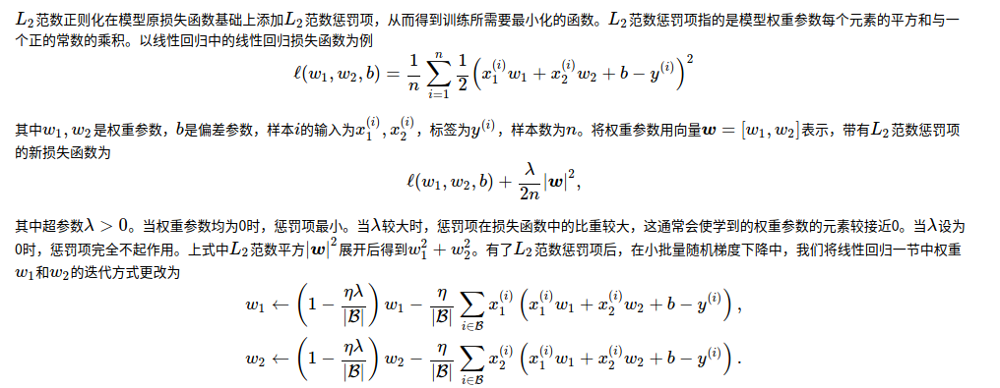

## 训练误差和泛化误差
机器学习模型应关注降低泛化误差

## K折交叉验证

由于验证数据集不参与模型训练，当训练数据不够用时，预留大量的验证数据显得太奢侈。一种改善的方法是K折交叉验证（K-fold cross-validation）。在K折交叉验证中，我们把原始训练数据集分割成K个不重合的子数据集，然后我们做K次模型训练和验证。每一次，我们使用一个子数据集验证模型，并使用其他K-1个子数据集来训练模型。在这K次训练和验证中，每次用来验证模型的子数据集都不同。最后，我们对这K次训练误差和验证误差分别求平均。

# 权重衰减
## L2 范数正则化
权重衰减等价于 L2 范数正则化（regularization）。正则化通过为模型损失函数添加惩罚项使学出的模型参数值较小，是应对过拟合的常用手段。

可见，L2范数正则化令权重w1和w2先自乘小于1的数，再减去不含惩罚项的梯度。因此，L2范数正则化又叫权重衰减。权重衰减通过惩罚绝对值较大的模型参数为需要学习的模型增加了限制，这可能对过拟合有效。

## 丢弃法
Dropout
对隐藏层使用丢弃法时，该层的隐藏单元将有一定概率被丢弃掉。